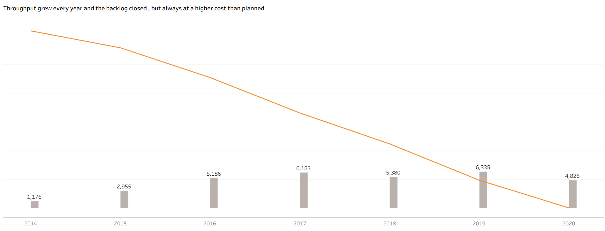
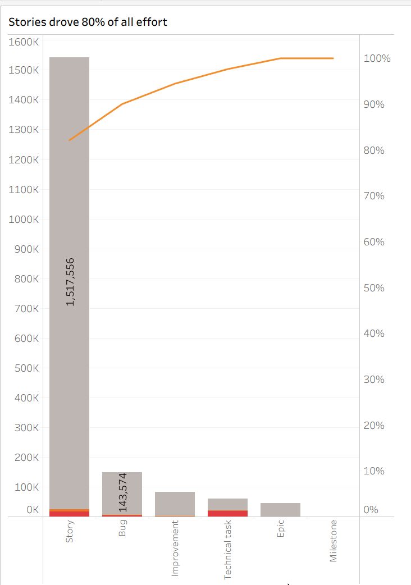
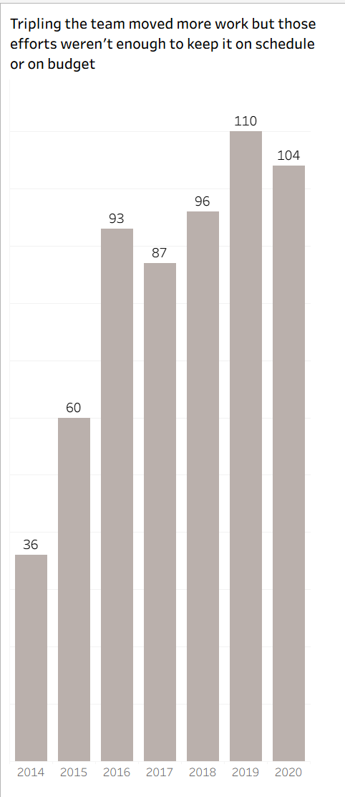
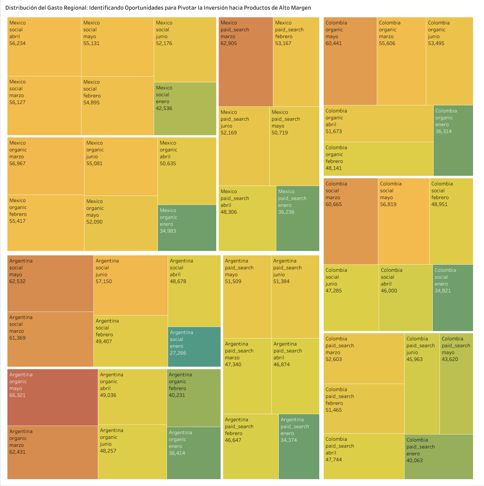
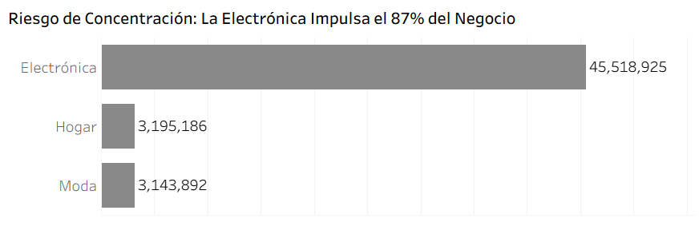
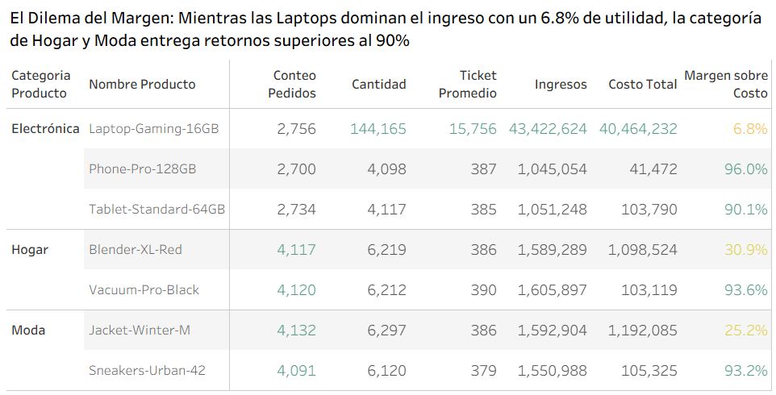

---

---
---

# ACERCA DE MÍ
Project Manager con una certificación de Data Analyst en progreso.
Mi enfoque no se limita a gestionar tareas; se trata de orquestar flujos de trabajo donde los datos dictan la estrategia y la tecnología potencia la experiencia.

[quere.michele@gmail.com](mailto:quere.michele@gmail.com) | +52 55 5072 8230 | [www.linkedin.com/in/michelequere](http://www.linkedin.com/in/michelequere) | México, CDMX

### Habilidades tecnológicas

- Análisis y gestión de Datos utilizando Google Sheets | SQL | Python
- Visualización de Datos usando Matplotlib |Seaborn | Tableau | PowerBI

### Habilidades Blandas

Análisis de datos | Resolución de problemas | Comunicación efectiva | Orientación a resultados | Atención al detalle

[Ir a Linkedin](http://www.linkedin.com/in/michelequere) 

## Análisis de Desempeño Operativo en el proyecto Lsstcorp Data Management

Tomamos el dataset tawos_test_clean.csv descargable aquí : https://www.kaggle.com/datasets/rachetkhanal/tawos-csv-clean?resource=download para escojer uno de los proyectos documentados y hacer un análisis de rendimiento del proyecto elegido: Lsstcorp Data Management de 2014 a 2020.

### Herramientas

Python | Pandas | Tableau

### Preguntas Clave

- ¿ Se tuvo éxito con la entrega del proyecto Lsstcorp Data Management?
- ¿Qué mejoras de gestión se implementaron para mantener el proyecto en el cronograma?
- ¿Los obstáculos principales en este proyecto radicaron en la capacidad y ejecución del equipo, o en deficiencias de planificación y gobernanza?

### Metodología

- Se exploraron los datos y se escogió el proyecto basado en la cantidad de entradas no nulas, es decir el proyecto que tenía el mayor número de registros completos
- Se estandarizaron fechas y se decidió rellenar los datos de Story Points faltantes con la mediana de los Story Points
- El SPI y CPI se calcularon con trabajo acumulado y las fechas de estimación para calcular el EV y PV. 16.8% de Fechas de estimación no estuvieron registradas y 22.1% de tiempo de esfuerzo real tampoco fueron registrados.
- Se crearon Dashboards de Overview y Detalle en Tableau para presentar conclusiones

### Conclusiones y recomendaciones

**Hallazgos:**

- **La gran batalla por el cronograma (SPI):** El proyecto arrancó con un fuerte retraso en 2014 (SPI de ~0.4), lo que sugiere que la planificación lineal inicial fue demasiado agresiva para la fase de arranque o que el equipo tardó en tomar ritmo. También pudo agrandarse el trabajo en los alcances del proyecto. Sin embargo, el proyecto no se estancó: muestra una **recuperación anual constante y sostenida durante 7 años**, logrando acelerar el paso año con año hasta cerrar exactamente a tiempo en 2020 con un SPI perfecto de 1.0.
- **La paradoja de la eficiencia en costos (CPI):** Al contrario del análisis previo, el proyecto fue **altamente eficiente en costos durante la mayor parte de su ciclo de vida (2015-2018)**, manteniéndose con un CPI saludablemente por encima de 1.0 (con picos de hasta 1.15), cuando se triplicó el equipo. Esto demuestra que la ejecución técnica intermedia fue sumamente limpia. La pérdida de eficiencia (CPI < 1.0) ocurrió estrictamente en la recta final (2019-2020), cuando bajaron de nuevo los números de integrantes del equipo, arrastrando el acumulado histórico a un aceptable 0.95 al cierre.
- **El impacto real del escalamiento:** Triplicar el tamaño del equipo (de 36 integrantes en 2014 a 110 en 2019) **sí funcionó para rescatar el cronograma**. El incremento de personal coincide directamente con la aceleración del SPI. Sin embargo, hacia los últimos dos años se observa el clásico efecto de los rendimientos decrecientes: el costo de coordinación y la complejidad del equipo penalizaron el CPI, haciéndolo caer por debajo de 1.0 al final.

**Recomendaciones:**

- Se sugiere definir hitos formales desde el inicio del proyecto aunque estos varien a lo largo del ciclo de vida del proyecto, no hasta el año 5. Los hitos obligan a tomar decisiones de gobernanza, crean puntos de control naturales para revisar las desviaciones de CPI y SPI, y le dan al liderazgo momentos estructurados para intervenir antes de que el bajo desempeño se vuelva crónico. Un proyecto que dura 7 años sin hitos no tiene un sistema de alerta temprana. Tal vez el error sólo es de rigor de documentación en Jira.
- Tolerancia implícita a desviaciones crónicas. Mantener los índices de desempeño (CPI/SPI) apenas por debajo de 1.0 de manera sostenida oculta ineficiencias en la planeación y genera pérdidas financieras acumuladas severas, aun cuando la ejecución técnica sea sólida. Implementar un protocolo de escalamiento automático ante variaciones lineales estables. Se sugiere un diagnóstico temprano enfocado en la calibración de las estimaciones y la revisión de la gobernanza del alcance, evitando asumir que la estabilidad del indicador exime al proyecto de una revisión de causa raíz.
- Más rigor en la documentación de Jira (u otro software de manejo de proyectos) es muy útil para analizar los procesos y ver dónde se sale de control el proyecto.

### Visualizaciones

Gráfico de líneas para visualizar la evolución del SPI y CPI durante la duración del proyecto

.png)

Burndown para revisar el número de story points completados por año (con granularidad dinámica para filtrar por año

Diagramas de Pareto y de Barras para visualizar el esfuerzo total en horas por tipo de ticket y el crecimiento del equipo por año

Link a Tableau Public:

[https://public.tableau.com/views/DashboardLsst/Overview?:language=es-ES&publish=yes&:sid=&:redirect=auth&:display_count=n&:origin=viz_share_link](https://public.tableau.com/views/DashboardLsst/Overview?:language=es-ES&publish=yes&:sid=&:redirect=auth&:display_count=n&:origin=viz_share_link)

Ver el repositorio completo:

## Proyecto RappiPlus

El objetivo de este proyecto es evaluar el desempeño del servicio **RappiPlus** para apoyar **decisiones de negocio basadas en datos**.

Se trabajan con múltiples datasets del negocio:

- **rappiplus_orders_raw.csv:** información de pedidos, precios, descuentos y revenue
- **rappiplus_catalog.csv:** costos de productos, categorías y proveedores
- **rappiplus_marketing_spend.csv:** inversión en marketing por canal y país
- **events / users / user_activity (SQL):** comportamiento del usuario dentro de la plataforma
- **experiment_checkout_ui.csv:** resultados de un experimento A/B en el checkout

#### Herramientas

Python | Pandas | SQL | Tableau

### Preguntas Clave

- ¿Los usuarios realmente compran más?
- ¿El modelo está generando ganancias?
- ¿Se están perdiendo oportunidades en el proceso de compra?

### Metodología

- Se limpiaron y estandarizaron los datos, eliminando inconsistencias y verificando la ausencia de duplicados y valores faltantes.
- Se hizo un análisis de la rentabilidad del negocio: Se calcularon ingresos totales, costo total, inversión en Marketing y margen sobre costos y marketing. También se calculó el ticket promedio por orden, la cantidad promedio de productos por orden, el gasto en marketing por canal y se encontró el producto más vendido
- Se construyó un funnel de conversión y se hizo un análisis de la conversión entre cada paso para encontrar en qué etapa se pierden más usuarios. Posteriormente se realizó la evaluación de la retención por cohortes.
- Se analizó mediante una prueba Chi-cuadrado si había o no diferencia entre las dos variantes del producto.

### Conclusiones y recomendaciones

#### Hallazgos:

- **Argentina es el motor de rentabilidad:** Aunque vende casi lo mismo que México ($20.7M vs $19.7M), **Argentina entrega el 76% de la utilidad total del negocio** ($4.5M) con un espectacular margen del **21.73%**.
- **Ineficiencia táctica en México:** México es el país donde más dinero se gasta en Marketing ($988K), pero es el menos rentable de la región, aportando apenas un **3.27% de margen** ($645K de utilidad). Estamos quemando el presupuesto de adquisición en el mercado que menos retornos genera.
- **Dependencia extrema de un producto de bajo margen:** La *Laptop-Gaming-16GB* es un gigante que sostiene el **83.7% de los ingresos totales** de la operación ($43.4M de los $51.8M totales). El problema es que su margen es sumamente castigado (**6.81%**). Si el proveedor de laptops falla o cambia los precios, el negocio completo entra en pérdida.
- **Joyas ocultas sin volumen:** Los teléfonos, aspiradoras y tablets (*Phone-Pro, Vacuum-Pro, Tablet-Standard*) registran márgenes de ganancia brutales de **entre el 90% y el 96%**, pero sus volúmenes de venta son insignificantes en comparación con la laptop
- **El muro del Checkout:** El flujo de navegación es impecable: más del 90% de los usuarios que interactúan añaden productos y avanzan con una intención de compra altísima. Sin embargo, **el mayor cuello de botella es el abandono del 13% en `add_payment_info`**. Los usuarios quieren el producto, pero se echan para atrás cuando la plataforma les pide los datos de pago.
- **Retención de acero con techo de cristal:** Una retención que se congela de forma plana entre el 40% y 43% desde la semana 1 hasta la semana 4 demuestra que el producto tiene un *Product-Market Fit* muy sólido entre sus usuarios recurrentes. Sin embargo, está estancada. Las nuevas cohortes no están incrementando su compromiso a lo largo del tiempo, evidenciando un onboarding plano.
- **A/B Testing, un cambio irrelevante:** Con un p-value > 0.05, la variante de Tratamiento (16.3% de conversión) no demostró superioridad estadística real sobre el Control (15.7%). La muestra de ~10,000 usuarios combinados confirma que el rediseño o cambio evaluado no mueve la aguja del negocio.

#### recomendaciones:

- Reducir de inmediato el gasto de marketing en México (frenar la adquisición ineficiente) y reasignar esos fondos a **Argentina** para potenciar el mercado de alto margen (21.73%), y a **Colombia** para incentivar el crecimiento de su volumen.
- Recomendamos impulsar productos como el Phone-Pro-128GB (96% de margen) y la Vacuum-Pro-Black (94% de margen). Actualmente tienen un volumen de órdenes saludable pero un impacto mínimo en el ingreso total debido a su bajo precio o menor rotación comparada con las laptops.
- Priorizar los esfuerzos para resolver el drop-off del 13% en la pantalla de pagos. Se deben auditar las tasas de rechazo bancario de tarjetas de débito/crédito, simplificar los campos del formulario y habilitar métodos de pago alternativos locales
- Reenfocar el presupuesto de campañas de retargeting genéricas a un sistema de **recompensas e incentivos dinámicos**. Como la retención se aplana desde la semana 1, se sugiere otorgar beneficios/descuentos crecientes condicionados al uso consecutivo
- No se recomienda hacer el roll-out de la variante de tratamiento.

### Visualizaciones

Visualización diseñada para auditar la productividad del capital. El gráfico demuestra la sobredimensión del gasto en México (focalizado en *Social* y *Paid Search*) frente a un retorno de facturación que no justifica dicha proporcionalidad respecto a Argentina. Sirve como evidencia analítica irreversible para dar cumplimiento a la directriz de optimización: contraer el presupuesto ineficiente e inyectar liquidez en la plaza de mayor rendimiento.

Módulo analítico diseñado para evaluar la salud de la mezcla de productos. Los datos demuestran que el volumen de facturación actual es frágil: el 87% de los ingresos está concentrado en la categoría de Electrónica, la cual está severamente impactada por el bajo margen operativo de su producto principal, la *Laptop-Gaming* (6.8%). Esta sección sirve como evidencia analítica irreversible para sustentar un viraje comercial: es prioritario desacelerar la dependencia de la línea líder y diseñar campañas de posicionamiento para los productos de Hogar y Moda que ofrecen retornos superiores al 90% sobre el costo.

link a Tableau Public:

[https://public.tableau.com/views/Sprint12_ProyectoFinal/DashboardOverview?:language=es-ES&:sid=&:redirect=auth&:display_count=n&:origin=viz_share_link](https://public.tableau.com/views/Sprint12_ProyectoFinal/DashboardOverview?:language=es-ES&:sid=&:redirect=auth&:display_count=n&:origin=viz_share_link)

ver repositorio completo:

## **Estrategia comercial de Andes Capital Real Estate**

La empresa gestiona la venta de diferentes tipos de propiedades a través de distintos canales de venta y segmentos de clientes. La información existe a nivel transaccional, pero el cliente busca una visión analítica clara del negocio. Se crea un dashboard interactivo en Power BI para lograrlo con los datasets siguientes:

hecho_ventas_propiedades.csv

dim_clientes.csv

dim_propiedades.csv

dim_fecha.csv

#### Herramientas

Power BI

#### Metodología

- Con ayuda de Power Query checamos duplicados y valores nulos. Se estandarizaron los tipos de datos.
- Se creó una tabla dim_fecha para poder crear medidas de inteligencia de tiempo
- Se conectaron las 3 tablas gracias a id_propiedad e id_cliente
- Se crean medidas con contexto de filtro y medidas para análisis de cohortes.
- Se realizan Dashboard de Overview, Análisis Comercial, Detalle Canal de Venta, Detalle Tipo de Propiedad, Detalle Segmento Comprador, Tamaño y Número de habitaciones, Cohorte Mes Venta y Cohorte Retención

#### Preguntas Clave:

- ¿Cuál es el **ingreso total** generado por las ventas de propiedades?
- ¿Qué **tipo de propiedad genera más ingresos**?
- ¿Qué **segmentos de clientes compran más**?
- ¿Cómo evolucionan las **ventas en el tiempo**?
- ¿El negocio está **creciendo año contra año**?
- ¿Los clientes **vuelven a comprar después de su primera compra**?

**Hallazgos clave**

- El ingreso total del periodo 2023-2024 fue de 6,012.5 Millones generado por 8500 ventas.
- El tipo de propiedad que genera mayores ingresos son las casas, 1,147 Millones en 2024
- La Ciudad de México es el motor principal de ingresos, 1,704 Millones en 2024
- El canal de Corredores sostiene la estructura comercial con el 72.8% de la facturación.
- El Producto Estrella para la cantidad de ventas son las unidades de 100.40 m² con 2 y 3 habitaciones son el estándar de mayor rotación y liquidez en el inventario actual.
- Hay un margen del 3% estable sobre las comisiones.

**Métricas principales**

- Ingreso Total: 6,012.5 Millones durante 2023 y 2024
- Cantidad de Ventas: 8500 ventas durante 2023 y 2024
- Ticket Promedio: 707,350 durante 2023 y 2024
- Comisión Total: 200,630 durante 2023 y 2024

**Insights accionables**

- Existe una dependencia crítica del comprador de "Primera vez", que representa el 62.9% de los ingresos pero tiene más recurrencia sólo en las propiedades Comerciales y Casas.
- Existe una estacionalidad marcada: Las ventas se concentran peligrosamente en Otoño y Primavera, sufriendo caídas de hasta el 36% durante el invierno y el verano. Esto coincide con el cierre de ciclos fiscales y el pago de bonos anuales o utilidades en ambas regiones para
el primer periodo y como hipótesis, el volumen masivo de transacciones de departamentos en Otoño (835 ventas) sugiere que las familias buscan asegurar su vivienda antes de las festividades de diciembre.
- El segmento de clientes de primera vez concentra la mayor parte del ingreso, pero los Inversionistas y Alto Patrimonio son más recurrentes.
- Los clientes adquiridos en las cohortes de 2023 en los meses de Febrero, Marzo y Abril muestran mayor recurrencia.
- Las ventas muestran un crecimiento de 11.1% YoY. Aunque ese crecimiento se va ralentizando puesto que la línea de tendencia del MoM va a la baja.
- La retención de clientes aparece más en el Canal Directo. También existe retención en los clientes inversionistas que compran casas y propiedades de índole comercial. Es decir se ve retención de clientes en propiedades de valor Alto.

**Recomendaciones estratégicas**

- Se sugiere **Mantener la Escala en el canal de Corredor:** Es el motor de alta rotación. Se usa para vaciar rápido el inventario estándar y mantener el flujo de caja constante, este sería continuar con la captación de departamentos de menos de 100 m2 de 2 y 3 recámaras de primera vez.  Así mismo, hay que **Impulsar la Rentabilidad en el canal directo:** Es el canal exclusivo para el "Programa Premium". Al no pagar comisiones externas, protege el margen del 3% y captura tickets más altos libres de competencia masiva.
- El segundo escenario interesante son las unidades de más de 200m², están libres de la competencia del comprador masivo de "Primera vez", siendo un territorio exclusivo para Inversionistas, el cual creció $128 millones y con un ticket promedio mayor, sobre todo las de tipo Comercial. Se necesita una diversificación dinámica del portafolio para captar este tipo de propiedades e incrementar la cartera de este tipo de compradores.
- Implementar un Programa de Lealtad Premium, es decir un esquema de beneficios para "Inversionistas Frecuentes" basado en el comportamiento observado en las cohortes que compran propiedades menores a los 100 m2, incentivando la compra de la segunda y tercera unidad. Este plan también buscaría incentivar cohortes más recientes (2024) a regresar a comprar.
- Este programa de Lealtad Premium podría ofrecerse más agresivamente durante verano e invierno con vistas a estabilizar el decrecimiento estacional durante estas épocas del año.

#### Visualizaciones

Presento los dashboards con sus drill through

